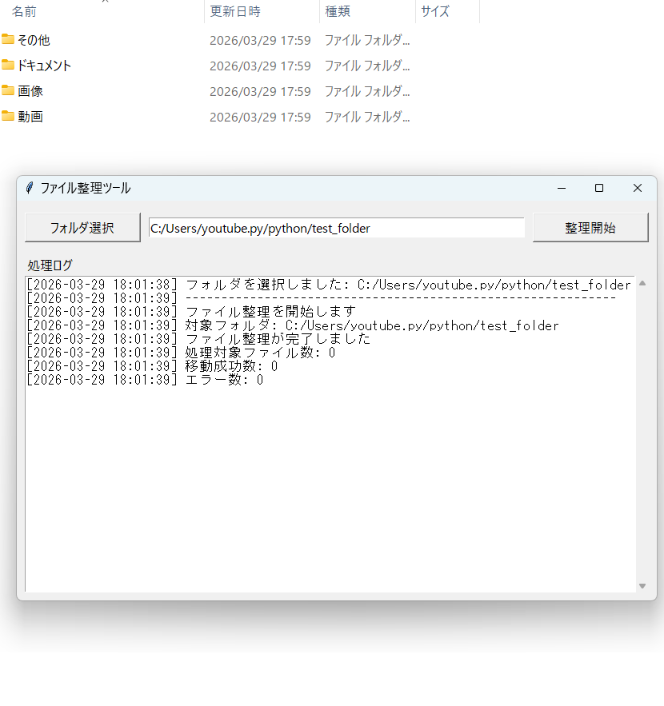

## Preview

# 📂 File Organizer (Python)

Simple Python tool that automatically sorts files by extension.

---

## 🚀 Overview

このツールは、フォルダ内のファイルを自動で分類して整理するPythonスクリプトです。

拡張子ごとにフォルダを作成し、安全にファイルを移動します。

---

## ✨ Features

- 📁 ファイルを自動分類（画像 / 動画 / ドキュメント / その他）
- 🔄 同名ファイルは自動でリネーム（(1), (2)）
- ⚡ シンプル＆高速
- 🧠 初心者向けコード

---

## 🛠️ Usage

### 1. リポジトリをダウンロード

git clone https://github.com/aiappkobo/neo_file_organizer.git

### 2. 設定を変更
target_folder = r"ここに整理したいフォルダのパス"

### 3. 実行
python main.py
⚠️ Notes
ファイルが実際に移動されます
最初はテスト用フォルダで試してください

🧠 Tech
Python
os / shutil
🔥 Future Plans
GUI版（Tkinter）
EXE化
ドラッグ＆ドロップ対応
